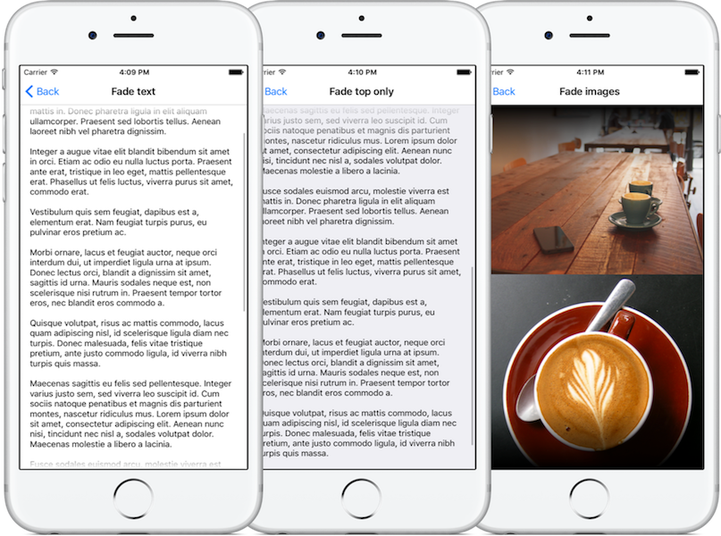

# BDFadingScrollView
It's Swift-ified fork of [SSFadingScrollView](https://github.com/stephsharp/SSFadingScrollView)

A UIScrollView subclass that fades the leading and/or trailing edges of a scroll view to transparent. It animates the gradient in and out based on the current content offset, and uses a mask to fade the scroll view content without also fading the scroll bars.

## Screenshots by [Stephanie Sharp](https://github.com/stephsharp)

## Features

- [x] Fade top and/or bottom of vertical scroll view
- [x] Fade left and/or right of horizontal scroll view
- [x] Animated fade in and out (based on content offset) with customizable duration
- [x] Adjustable gradient size
- [x] Scroll bars don't fade out with the scroll view content
- [x] IBInspectable properties allow you to set up your fading scroll view entirely in Interface Builder. (See the demo project for an example.)

## Properties

##### fadeLeadingEdge

Fade leading edge of fade axis. Default is `true`.

##### fadeTrailingEdge

Fade trailing edge of fade axis. Default is `true`.

##### fadeSize

Size of gradient. Default is `30`.

##### fadeDuration

Duration of fade in & out. Default is `0.3` seconds.

##### maskScrollBars

Default is `true`. Scroll bars are masked so they don't fade with the scroll view content. Set to `false` to fade out the scroll bars along with the content.

## Installation

### Swift Package Manager

Add following line to your  `dependencies` in `Package.swift` file in your project:

    .package(url: "https://github.com/bdolewski/BDFadingScrollView", from: "1.0.0")

### Manual installation

Just copy file `BDFadingScrollView.swift` into Xcode and have fun 🙂

## Acknowledgements

With thanks to:
 - [Stephanie Sharp](https://github.com/stephsharp)/[SSFadingScrollView](https://github.com/stephsharp/SSFadingScrollView)

Photos in the demo project were sourced from [Unsplash](https://unsplash.com/).
 
## License

BDFadingScrollView is released under the MIT license. See LICENSE for details.
 
